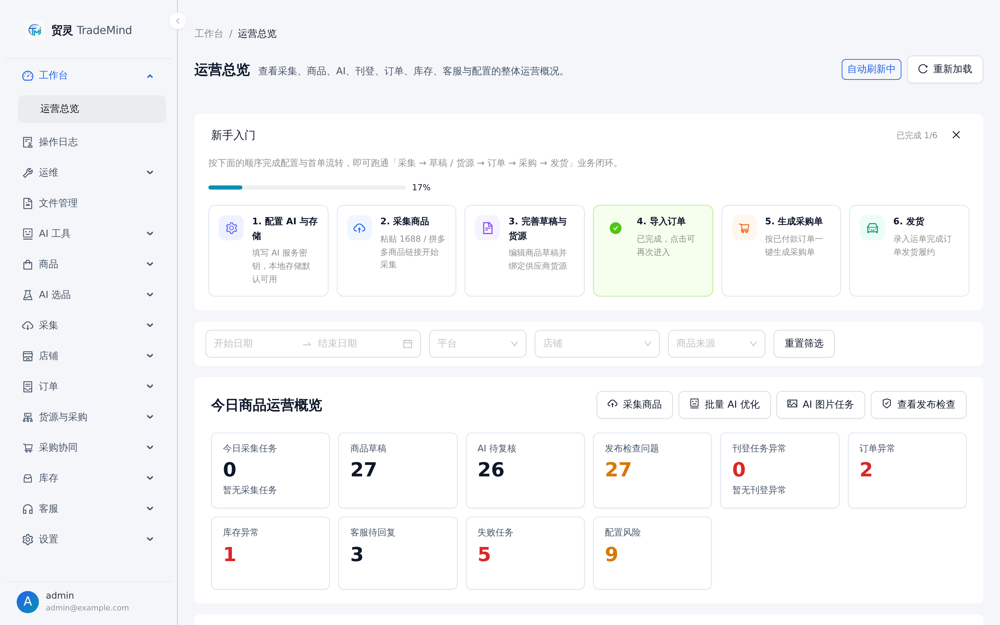
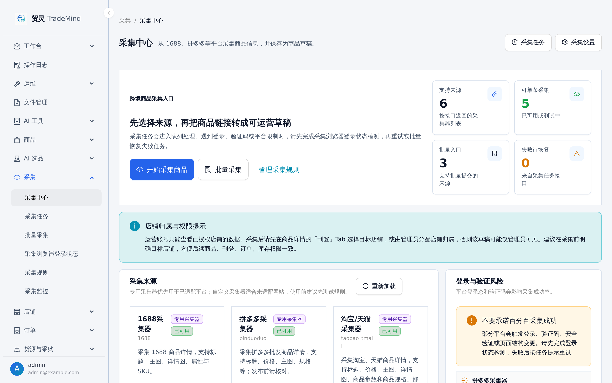
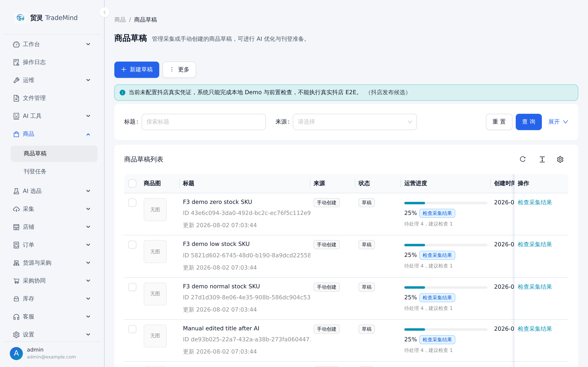
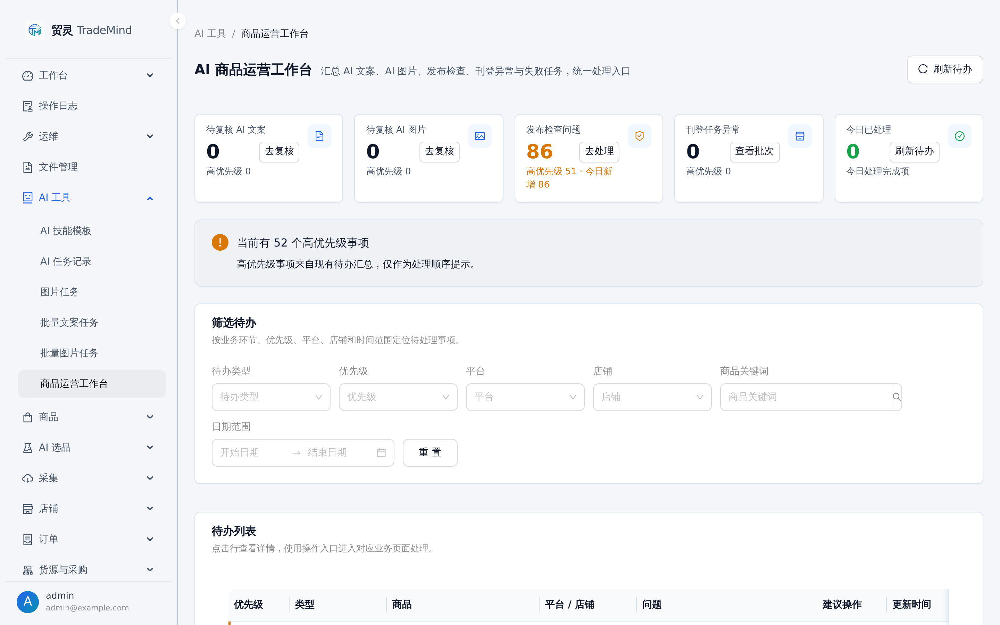
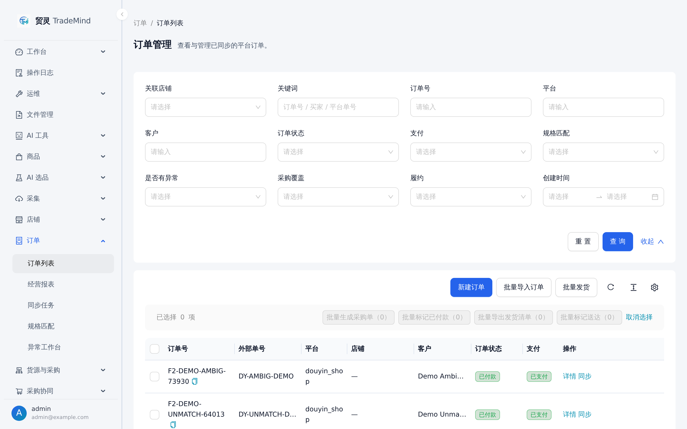
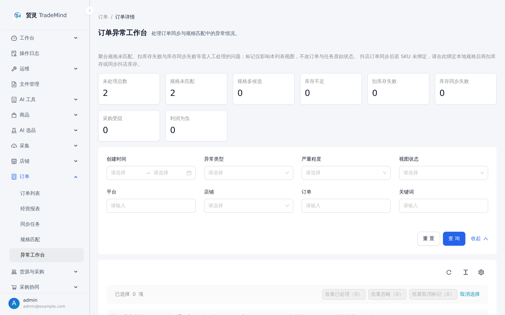
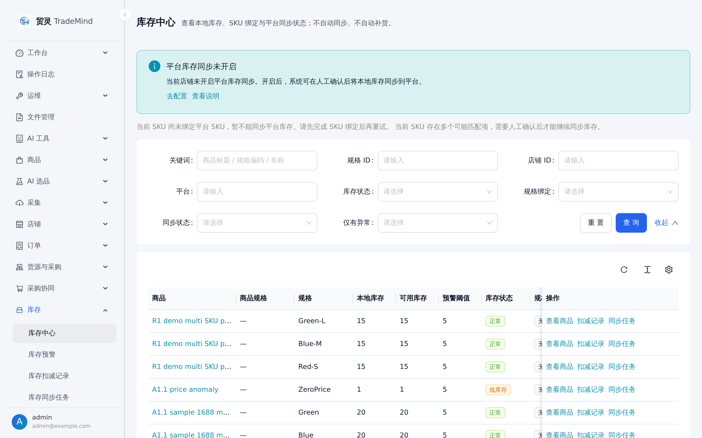
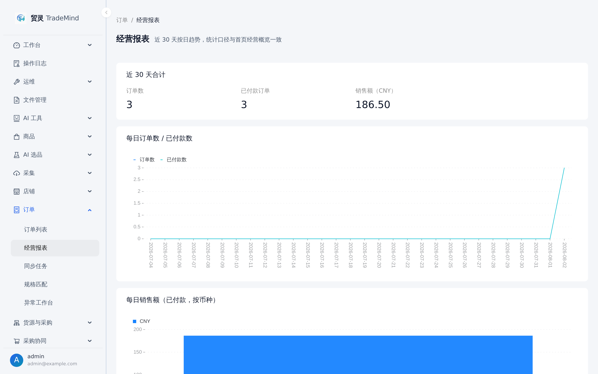

<h1 align="center">TradeMind</h1>

<p align="center">
  <strong>Open-source AI Commerce Operations Platform</strong>
</p>

<p align="center">
  Built around the operator's daily loop: sourcing & collection → AI optimization → drafts → suppliers / SKUs → orders → procurement → inventory → fulfillment → business analytics
</p>

<p align="center">
  <a href="LICENSE"></a>
  
  
  
  
  
</p>

<p align="center">
  <a href="README.md">简体中文</a> | English
</p>

<p align="center">
  <a href="#quick-start">Quick Start</a> ·
  <a href="#screenshots">Screenshots</a> ·
  <a href="#business-loop-and-core-capabilities">Core Capabilities</a> ·
  <a href="#architecture-and-stack">Architecture & Stack</a> ·
  <a href="docs/README.md">Docs</a>
</p>

<p align="center">
  
</p>

TradeMind is an open-source AI operations platform for cross-border commerce sellers and developer teams. It is built around the business loop that operators run every day: collect and select products from sourcing marketplaces such as 1688 and Pinduoduo, optimize titles, descriptions, and images with AI, organize them into publish-ready drafts, bind suppliers and SKUs, sync and process platform orders, aggregate purchase orders, manage inventory and fulfillment, and review business analytics.

The project currently serves two priorities: `AI product operations` and a `lightweight cross-platform ERP MVP`. Rather than trying to become a heavy all-in-one ERP with multi-warehouse, finance, or WMS / OMS coverage, TradeMind focuses on a self-hosted, extensible foundation that teams can adapt to their own workflows.

## Business Loop and Core Capabilities

```text
Collection & selection → AI optimization → Drafts → Supplier / SKU binding → Publishing
        ↑                                                                       ↓
Business analytics ← Fulfillment ← Inventory ← Procurement ← Order sync & processing
```

### Collection and Selection

- Product collection: dedicated collectors for 1688, Pinduoduo, and Taobao / Tmall plus custom-rule collection, with single and batch submission.
- Collection operations: task tracking, failure retry, monitoring (workers / tasks / batches), and browser login-state checks.
- AI selection: selection tasks and a publish-ready shortlist to help filter collected products worth operating.

### AI Content and Product Drafts

- AI copy: title optimization, description generation, prompt skill templates, result comparison, manual apply, and undo.
- AI images: background removal, translation, and other image tasks via remove.bg, OpenAI Image, ComfyUI, and other providers, executed through async task queues.
- Batch AI: batch copy tasks, batch image tasks, and batch review flows, unified in the product operations workbench.
- Product drafts: unified management of products, SKUs, images, inventory thresholds, and pre-publish readiness checks, with operation-progress tracking.

### Publishing and Stores

- Store authorization: a working Douyin Shop OAuth loop, encrypted secrets, and connection tests.
- Product publishing: a multi-platform listing center, single-product and batch draft creation, batch publishing, draft mapping, publish tasks, failure recovery, and manual correction.

### Orders → Procurement → Inventory → Fulfillment

- Full order lifecycle: order sync, manual creation and batch import, SKU matching, and batch operations (mark paid / ship / export fulfillment lists).
- Exception workbench: aggregates unmatched SKUs, stock-deduction failures, inventory-sync failures, blocked procurement, negative margins, and other issues that need manual handling.
- Procurement collaboration: aggregate purchase orders from sales orders by supplier profile, export lists for manual ordering, and backfill 1688 order / tracking numbers (manual-ordering transition mode), with batch submit / confirm / mark-paid / receive.
- Sourcing management: supplier management and product sourcing profiles that connect orders to procurement.
- Inventory collaboration: inventory center, stock alerts, deduction records, stock ledger, and platform sync tasks and batches.
- Business reports: 30-day trends of orders, payments, and sales, consistent with the dashboard overview.

### Governance and Engineering

- Permission matrix: user and permission management, store-scoped data isolation, and navigation consistent with data permissions.
- Operation logs: audit trail for logins, configuration changes, task operations, AI applies, and other critical actions.
- Customer service: service center, conversation list, AI reply suggestions with manual confirmation before sending.
- Provider architecture: AI, storage, image, platform, and collector capabilities are all extended through provider abstractions.
- Reliability foundation: unified idempotency on critical writes, AI apply/undo protection, webhook fast ACK, and worker leases against stale writeback.
- Demo data: built-in seed scripts that create a demo dataset covering the whole loop in one command.

## Screenshots

The screenshots below come from the Docker Compose full-stack environment with the demo seed dataset.

<table>
  <tr>
    <td width="50%" align="center">
      
      <br />
      <sub><strong>Operations Dashboard</strong>: onboarding guide and today's operations overview</sub>
    </td>
    <td width="50%" align="center">
      
      <br />
      <sub><strong>Collection Center</strong>: multi-source collection entry points and login-risk hints</sub>
    </td>
  </tr>
  <tr>
    <td width="50%" align="center">
      
      <br />
      <sub><strong>Product Drafts</strong>: draft list, operation progress, and readiness checks</sub>
    </td>
    <td width="50%" align="center">
      
      <br />
      <sub><strong>AI Operations Workbench</strong>: copy / image review and unified to-do handling</sub>
    </td>
  </tr>
  <tr>
    <td width="50%" align="center">
      
      <br />
      <sub><strong>Order Management</strong>: order sync, filtering, and batch operations</sub>
    </td>
    <td width="50%" align="center">
      
      <br />
      <sub><strong>Order Exception Workbench</strong>: aggregated handling of unmatched SKUs and other exceptions</sub>
    </td>
  </tr>
  <tr>
    <td width="50%" align="center">
      
      <br />
      <sub><strong>Inventory Center</strong>: local stock, SKU binding, and platform sync status</sub>
    </td>
    <td width="50%" align="center">
      
      <br />
      <sub><strong>Business Reports</strong>: 30-day order and sales trends</sub>
    </td>
  </tr>
</table>

## Architecture and Stack

```text
React + Ant Design Pro (admin)
        ↓
Go + Gin + GORM (backend API)
        ↓                ↘
PostgreSQL          Redis queues
                         ↓
        Node.js + Playwright (collector)
```

| Layer | Stack |
| --- | --- |
| Backend | Go + Gin + GORM |
| Admin | React + TypeScript + Ant Design Pro |
| Collector | Node.js + TypeScript + Playwright |
| Data | PostgreSQL + Redis |
| Deploy | pnpm workspace + Docker Compose |
| Extension Points | AI / Storage / Image / Platform / Collector Providers |

## Quick Start

### Docker One-command Start (Recommended)

```bash
cp .env.docker.example .env
docker compose -f docker-compose.full.yml up -d --build
```

Windows PowerShell:

```powershell
Copy-Item .env.docker.example .env
docker compose -f docker-compose.full.yml up -d --build
```

Default URLs:

| Service | URL |
| --- | --- |
| Admin | <http://127.0.0.1:8000> |
| Backend Health | <http://127.0.0.1:8080/health> |
| Collector Health | <http://127.0.0.1:3001/health> |

The default admin account is defined by `ADMIN_BOOTSTRAP_EMAIL` / `ADMIN_BOOTSTRAP_PASSWORD` in your `.env` (example values in `.env.docker.example`; always change them to strong random values in production).

### Demo Data (Optional)

Once the services are up, you can seed a demo dataset covering the whole loop (collection → drafts → orders → inventory → reports) in one command:

```powershell
pnpm seed:demo-data          # demo dataset
pnpm seed:demo-permissions   # demo roles and permissions
```

Go full-chain demo seed (idempotent, one-command cleanup):

```bash
pnpm seed:demo:full          # generate DEMO- prefixed full-chain demo data
pnpm seed:demo:full:verify   # verify demo data
pnpm seed:demo:full:clean    # remove only DEMO- prefixed data
```

On Linux / macOS, install [PowerShell 7](https://learn.microsoft.com/powershell/scripting/install/installing-powershell) first, then run `bash scripts/seed-demo-data.sh`. See [docs/DEMO_SEEDING_GUIDE.md](docs/DEMO_SEEDING_GUIDE.md) for details.

### Local Development

```bash
pnpm install
pnpm install:collector:browsers
pnpm dev
```

Useful commands:

```bash
pnpm check:dev        # development environment self-check
pnpm dev:infra        # PostgreSQL + Redis only
pnpm dev:backend      # backend only
pnpm dev:admin        # admin only
pnpm dev:collector    # collector only
pnpm build:admin
pnpm build:collector
```

Further reading:

- [Local development](docs/development.md)
- [Docker deployment](docs/docker-deployment.md)
- [Production deployment (domain + HTTPS)](docs/production-deployment.md)
- [Environment variables](docs/env.md)

## Documentation

- [docs/README.md](docs/README.md): documentation hub (categorized index: usage / deployment / development / testing / security).
- [docs/operations-manual.md](docs/operations-manual.md): day-to-day operations manual (selection → listing → procurement → fulfillment).
- [docs/development.md](docs/development.md): local development, debugging, and commands.
- [docs/docker-deployment.md](docs/docker-deployment.md): full Docker Compose deployment and operations.
- [docs/api.md](docs/api.md): API contracts, response conventions, and auth notes.
- [docs/provider.md](docs/provider.md): provider extension model and safety constraints.
- [docs/architecture.md](docs/architecture.md): architecture, layering, and data flow.
- [docs/branching.md](docs/branching.md): branch strategy and PR workflow.

## Contributing and Community

- Read [CONTRIBUTING.md](CONTRIBUTING.md) before opening a PR.
- Review [SECURITY.md](SECURITY.md) for security reporting.
- PRs that improve screenshots, sample data, or docs are also welcome.
- Sponsorship info is available in [docs/sponsor.md](docs/sponsor.md).

## License

This project is open-sourced under the [Apache License 2.0](LICENSE).
